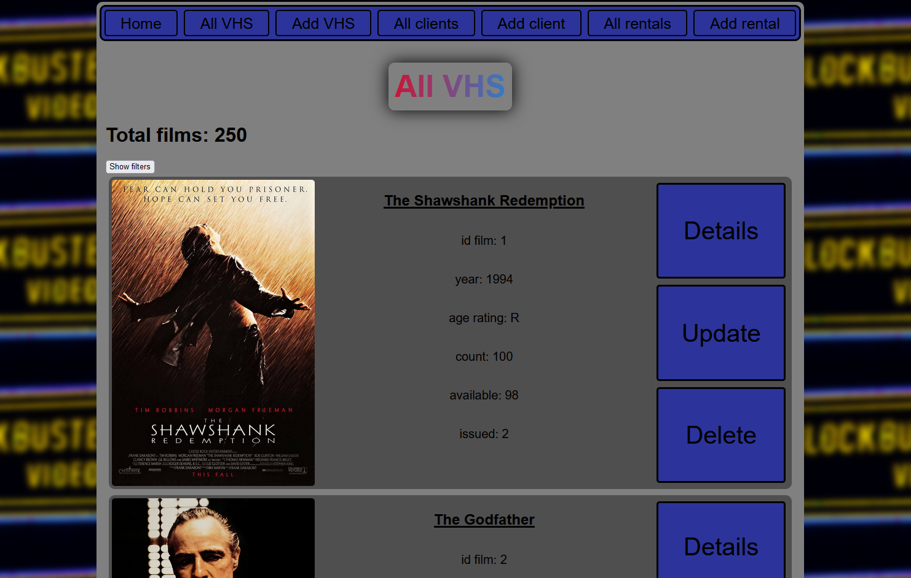

# CRUD application simulating the operation of a videotape rental shop.

Project objective:

* Interaction frontend - backend - database
* Work with the database (creating, reading, updating, deleting records) and specifically one-to-many relationship
* Populating the database with data from an external site. This is an unexpected goal, I didn't plan it originally, just after creating all the functionality of the database it turned out to be necessary to fill it, and I don't want to fill it manually (I'm a liny). Implemented the ability to download the top 250 movies from [https://www.imdb.com/](https://www.imdb.com).
* Learn Flask and basically how frameworks work 
* Work with SQLAlchemy
* Write a frontend that will approximate a typical site, try to make the site look nice
* Creating your own package, working with \_\_init__.py

# Development progress and related challenges

<u>Frontend</u>:

