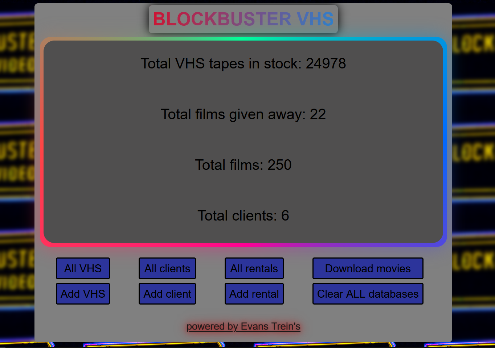
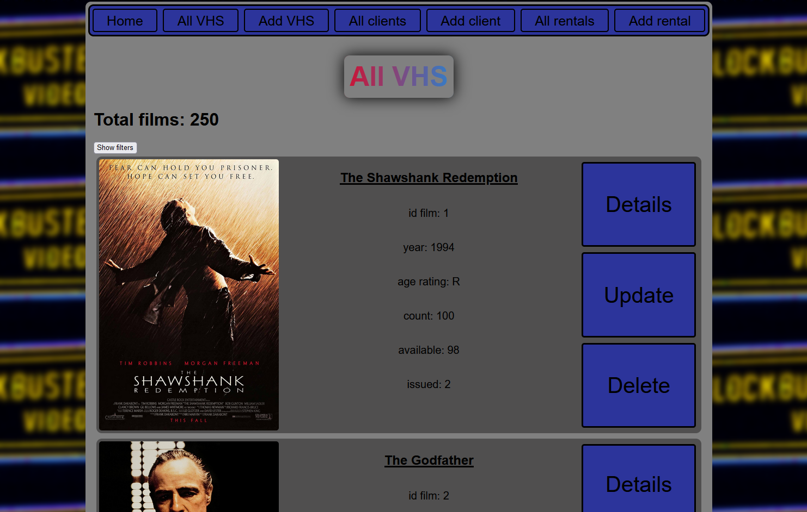
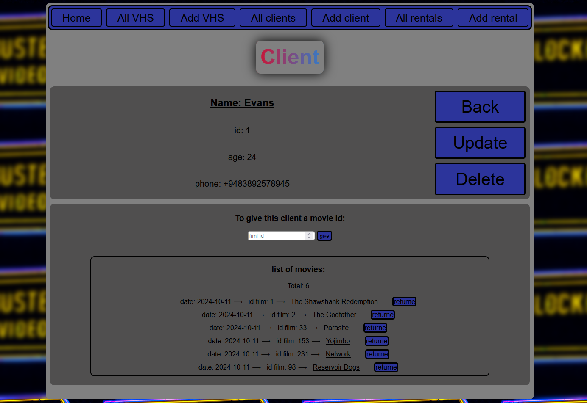

# CRUD-приложение, имитирующее работу пункта проката видеокассет.

Цель проекта:

* Взаимодействие фронтенд - бэкенд - база данных.
* Работа с базой данных (создание, чтение, обновление, удаление записей) + отношение «один-ко-многим».
* Пополнение базы данных данными с внешнего сайта. Это неожиданная цель, я не планировал ее изначально, просто после создания всего функционала базы данных оказалось, что ее нужно заполнить, а вручную я ее заполнять не хочу (я ленивый). Реализована возможность скачать 250 лучших фильмов с [https://www.imdb.com/](https://www.imdb.com)
* Изучить Flask и вообще как работают фреймворки. 
* Поработать с SQLAlchemy
* Написать фронтенд, который будет приближен к типичному сайту, постараться, чтобы сайт выглядел красиво
* Создание собственного пакета, работа с \_\_init__.py
* Работа с архитектурой проекта

# Историю от заказчика я придумал такую

Надо создать сайт, на котором магазин проката фильмов может вести учет клиентов и кассет. Нужны возможности добавить фильм (также добавить какое-то количество кассет этого фильма на склад), зарегистрировать клиента, выдать фильм клиенту, вернуть фильм клиентом. И выводиь статистику, как общую, так и по клиенту отдельно. Отельное требование заказчика - "хочу создать клиента или найти по имени на сайте - провалится в него - и там ввести id фильма, чтобы выдать ему кассету"

# Прогресс разработки и связанные с ним проблемы

* **Frontend** - это было самое долгое по времени, хотелось сделать красиво, но получилось... Я в целом доволен, но это обусловлено тем, что улучшил знания HTML и CSS. Использовал новые для себя теги, сделал навбар, проботал с копированием базового шаблона в другие страницы. Про CSS, основное это FlexBox, который тут использовал впервые (пока изучал его, узнал про табличные и блочные модели сайтов, old-school). На сайте реализовано почти все в FlexBox или в FlexBox, внутри других FlexBox. В остальном - работа с позиционированием (position: relative / absolute), выравнивание контента, размер элемента по контенту. Совсем немного JavaScript, самые простые функции. Из минусов: сайт не адаптивный под устройства, я открывал его на своем телефоне, это ужас. Не было желания разбираться еще и с этим. Frontend, это не мое, базу выучил и нормально. 

* **Базы данных и SQLAlchemy** - это была основная цель, до этого не работал с базой данных, в рамках веб-приложения, только чистый SQL (учил, для понимания), но на нем не очень писать запросы, благо есть SQLAlchemy. Создать первую базу данных и начать с ней работать было очень просто. ООП сильно упростил задачи. Сложности начались, когда три разные базы данных нужно зарегистрировать в одном приложении, тут узнал про tablename и bind_key, это помогло. Далее, связь один к многим, сначала пытался в двух, уже существующих, таблицах это сделать, но позже узнал, что можно для связей использовать отдельную, третью, таблицу и задача стала проще. На страницах с клиентами, фильмами и арендами есть фильтры, которые возвращают данные по заданным параметрам из базы данных. Есть вывод общей статистики, сколько фильмов, сколько клиентов, сколько кассет было выдано, если была выдача кассеты или возврат, то меняестя число доступных на складе кассет.

* **Отдельный сервис** - проверка данных, перед конкретным действием с базой: 

  - запрещено выдавать 1 фильм два раза одному клиенту 
  - запрещено удалять клиента или фильм, если по ним числится аренда
  - запрещено выдавать фильм если нет на складе свободных кассет
  - запрещено выдавать фильм, если такого фильма нет (внезапно!) или если нет клиента с таким id
  - запрещено выдавать фильм рейтингом R и выше клиенту, которому нет 18 лет
  - запрещено создавать один и тот же фильм как две разные записи в базе
  - запрещено создавать одно и того же клиента дважды, имя должно быть уникальным
  - запрещено, создавать клиента с номером телефона несоответствующего формата
  - запрещено создавать клиента, который младше 14 лет
  - запрещено создавать записи, если не указать данные в всех полях
  - при измении данных клиента или фильма, новая информация проходит такую же проверку, как и при создании записи

* **Отдельный сервис** - заполнение базы данных фильмов из топ 250 сайта [https://www.imdb.com/](https://www.imdb.com). Когда сделал базы данных, понял, что нужно ее наполнить, но вручную забивать фильмы не хотел. И решил взять топовые фильмы с строннего сайта. 

  - Началось все хорошо и казалось простым, загрузить данные с сайта, найти в них нужную информацию (взять нужный тег из HTML, который получил). Т.е. делаем запрос, получаем данные, обрабатываем их, записываем в базу данных. И это сделал, получил с топ 250 фильмов, первые 25 фильмов, первые 25, а не все. Тут я узнал, что такое динамичсекие страницы (контент подгружается не весь сразу, а последовательно, в зависимости от действий пользователя). Как решить? Ответ, который нашел - через Selenium (парсинг динамичсеких страниц), установил и начал пробовать, пошло сложно, но нормально, было интерсено, до момента пока не потребовалось детально посмотреть HTML дял решения проблем с парсингом. И тут, в ответе от сайта, в теге \<script>, я увидел JSON файл, в котормо были все 250 фильмов и вся нужная мне по ним информация. Даже, ссылки на постеры фильмов, поэтому решил добавить картинки в свою базу данных, изначально не планировал, но так как были ссылки, то скачивать и хранить картинки в базе не было необходимости. С получением JSON, сервис я дописал быстро, а Selenium удалил с проекта. 
  - Далее, нужно было реализовать возможность нажатия на сайте кнопки, которая запускала бы севрис. Для этого создал и зарегистрировал отдельный роутер, где и вызывается функция (функция это и есть сервис, она импортирована из соответствующего модуля), с помошью JavaScript появляется окно, куда нужно ввести количество для каждого фильма, что будет добавлен на склад. Тут не реализовано отображение процесса загрузки, руки не дошли.  

* **Backend** - с написанием кода на python сложности не было, ну строго говоря, тут и не было чего-то необычного. Сама работа с Flask тоже проходила нормально, все, что мне нужно, было уже в этом фреймворке. Например, возможность выгрузить папку static на сервер. В целом, работать с фреймворком мне понравилось. 

  - Отдельно отмечу, что я впервые сам создал логику при которой мы на стороне backend достаем данные (либо просто достаем, либо достаем по определенным параметрам) из базы данных и отправляем их в frontend. Тут и раскрылось понимание что такое фреймворк и как он сильно упрощает разработку, связывая между собой разные аспекты. 
  - Еще отдельно отмечу - вызовы функции для создания в базе данных новой аренды или фильма. Выдать фильм можно на отдельной вкладе, где понадобится id клиента и id фильма, но также можно выдать фильм, находясь в конкретном клиенте. Тут пришлось реализовать логику для каждого отдельного случая. Возможность удаления запсией в базе с арендами тоже имеется двойная, вернуть фильм можно на отдельно вкладе с всеми арендами, а можно в конкретном клиенте. Похожая история и с созданием нового фильма в базе данных, изначально не планировалсь загружать фильмы с сайта и была реализована только возможность ручного добавления, такая возможность осталась. Но с загрузкой фильмов с сайта добавились и картинки фильмов, которые ранее не планировались и хранились эти картинки по ссылкам, а не сами в базе данных. Если с фильмами с сайта картинки - уже были, то как быть с постером при ручном добавлении? Я добавил изображение по умолчанию, оно будет отображаться, если фильм добавили вручную и оно также хранится как ссылка в базе данных, а само изображение находится в папке static на сервере, т.е. ссылка в этом случае, указывает на путь к этой дефолтной картинке, а не на ссылку в ее привычном понимании.
  - **Я допустил ошибку в самом начале**, все роутеры были в одном файле и архитектура проекта выглядела очень плохо. По мере разрастания проекта и добавления новых роутеров (для клиента, для фильма, для аренды), добавления сервиса по получению фильмов, добавления шаблонов HTML - код выглядел огромным, в нем неудобно было ориентироваться. Это я прочувстовал, когда нужно было менять названия переменных в всем проекте и немного добавлять кода в разные места, в рамках одной задачи (я даже нашел расширения для VSCode, закладки: Bookmarks и Todo Tree), чтобы быстрее мог находить нужные места. 
  - Проблема с архитектурой стала самой значительной для меня в этом проекте. Целый день день потратил, чтобы привести ее к удобному виду. Сложности возникли с импортом, точнее с циклическим импортом и тем, что некоторым файлам требовался доступ к экземпляру приложения. Тут познакомился с \_\_init__.py и проблемы решились. Сама архитектура, я разбил ее на отдельные составляющие, в зависимости от назначения файлов. Всё приложение, теперь, лежит в отдельной папке, внутри которой есть файл с конфигурацией и экземпляром приложения, роутеры лежат отдельно и разбиты на 4 категории (клиент, фильм, аренда и домашняя страница), а сам файл для запуска приложения лежит в корне проекта.

# Как запустить 

Можете клонировать репозиторий, активировать виртуальное окружение, установить зависимости `pip install -r requirements.txt` и запустить файл `app.py`. На проекте успользуется python 3.12.1

Или через докер, образ есть на docker hub. Для скачивания введите `docker pull evanstrein/blockbuster_vhs`